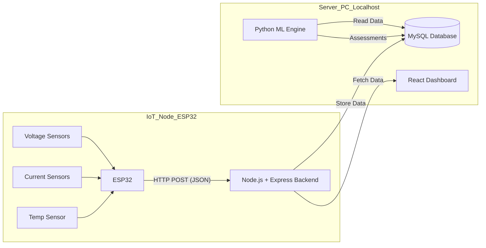

# Phase 1: System Planning and Data Simulation

## 1. High-Level System Architecture
The system follows a standard IoT-Cloud architecture optimized for a local academic prototype.

**Data Flow:**
1.  **Sensors** measure PV voltage/current, Battery voltage, and Load current.
2.  **ESP32** samples these values every few seconds, averages them, and sends a JSON payload via HTTP POST to the **Node.js Backend**.
3.  **Backend** timestamps and saves the raw data into **MySQL**.
4.  **Python Script** (Simulating the ML Engine) periodically queries new data, runs the `Random Forest` (Health) and `Isolation Forest` (Anomaly) models, and updates the database with predictions.
5.  **React Dashboard** polls the Backend to visualize real-time graphs and alerts.

---

## 2. Validity of Simulation for Academic Research
For an undergraduate project, simulating data in Phase 1 is scientifically valid and often preferred because:
1.  **Data Volume**: ML models require thousands of data points to train effectively. Collecting 30 days of real-time data would delay the project timeline. Simulation provides immediate "ideal" training data.
2.  **Controlled Conditions**: Simulation allows us to inject specific faults (e.g., "Battery Overheat" or "Sudden Voltage Drop") that are dangerous or difficult to reproduce on physical hardware.
3.  **Pipeline Verification**: It proves the software stack (Database, API, Frontend) works *before* introducing hardware bugs.

*In your final report, this demonstrates "Model-Based Design" methodology.*

---

## 3. Sensor Parameters (Simulated & Physical)
We will simulate the following 5 key parameters which correspond to real physical sensors:

| Parameter | Unit | Physical Sensor (Prototype) | Description |
| :--- | :--- | :--- | :--- |
| **PV Voltage** | Volts (V) | Voltage Divider / PZEM-004T | Output voltage from Solar Panels. |
| **PV Current** | Amps (A) | ACS712 / WCS1700 | Current flowing from Panels to Charge Controller. |
| **Battery Voltage** | Volts (V) | Voltage Divider (Simulated < 25V) | State of Charge (SoC) indicator. Critical for health. |
| **Load Current** | Amps (A) | ACS712 | Power consumption by the house/load. |
| **Temperature** | Celsius (°C) | DHT11 / DS18B20 | Battery/Ambient temperature to detect overheating. |

### 3.1 Feature Engineering (Computed Columns)
To improve ML model performance, the following features are derived from raw sensor data:
- **PV Power (W)**: $P = V_{pv} \times I_{pv}$. Represents total solar energy generation.
- **Net Energy Flux (A)**: $I_{net} = I_{pv} - I_{load}$. Positive = Charging, Negative = Draining.
- **Rolling Voltage (10m)**: 10-minute moving average of battery voltage to smoothe out sensor noise.
- **State of Charge (SoC %)**: Simple voltage estimation $SoC\% = \frac{V_{current} - 10.5}{14.4 - 10.5} \times 100$.

---

## 4. Integration Strategy
The synthetic data generated in this phase will have the **exact same CSV/JSON structure** as the real data packets sent by the ESP32 in Phase 2.
- **Phase 1**: Python script -> CSV -> Bulk Import to MySQL.
- **Phase 2**: ESP32 -> HTTP Post -> Node.js -> Insert to MySQL.
- The ML models will be agnostic to the source; they just read from the database table.

---

## 5. Report Chapter Mapping
- **Chapter 3 (Methodology)**: "System Design and Simulation Strategy". Use the diagram above.
- **Chapter 4 (Implementation)**: "Data Acquisition". Describe the sensor choices and the Python data generation logic.
- **Chapter 5 (Results)**: Compare the "Ideal Simulated Curves" vs "Real Prototype Curves" to show system accuracy.
